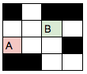
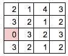
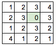
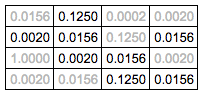
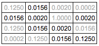
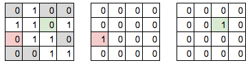

# Heuristic Analysis

## tournament.py modification

The file `tournament2.py` is copy of tournament.py, and is changed in following ways:

- Increase NUM_MATCHES from 5 to 25, so more matches will be done.
- Remove ID_Improved from test_agents, since ID_Improved is only needed to run once to get it's performance value.

## Heuristic functions

### ID_Improved (given)

ID_Improved calculate the number of available move of 2 players, and minus them to get the score.

The `tournament2.py` result is as follow:

<table border=1>
<tr><th></th><th>Random</th><th>MM_Null</th><th>MM_Open</th><th>MM_Improved</th><th>AB_Null</th><th>AB_Open</th><th>AB_Improved</th><th>Result</th></tr>
<tr><th>ID_Improved</th><td>93</td><td>76</td><td>43</td><td>52</td><td>65</td><td>44</td><td>53</td><td>60.86</td></tr>
</table>

### custom_score_0 (Improved ID_Improved)

The `custom_score_0` put n moves forward into consideration.

For example, in a 4x4 game:

We first do breadth first search to find number of move required to go to each cell, in empty board.

Since the calculation is based on empty board, the result can be cached to save CPU.

Then, for each cell which require n moves, we score it power(r,n).

For r = 1/8:

Finally, we sum up all cell which is not blocked, and subtract each other.

- Player A: value = 0.316
- Player B: value = 0.193
- score = 0.316 - 0.193 = 0.123

The `tournament2.py` result is as follow:

<table border=1>
<tr><th>r</th><th>Random</th><th>MM_Null</th><th>MM_Open</th><th>MM_Improved</th><th>AB_Null</th><th>AB_Open</th><th>AB_Improved</th><th>Result</th></tr>
<tr><th>1/5</th><td>95</td><td>88</td><td>54</td><td>41</td><td>72</td><td>58</td><td>61</td><td>67.00%</td></tr>
<tr><th>1/6</th><td>86</td><td>83</td><td>62</td><td>54</td><td>72</td><td>58</td><td>58</td><td>67.57%</td></tr>
<tr><th>1/7</th><td>91</td><td>83</td><td>48</td><td>53</td><td>73</td><td>54</td><td>53</td><td>65.00%</td></tr>
<tr><th>1/8</th><td>98</td><td>79</td><td>51</td><td>47</td><td>77</td><td>55</td><td>51</td><td>65.43%</td></tr>
<tr><th>1/9</th><td>94</td><td>82</td><td>54</td><td>52</td><td>72</td><td>53</td><td>56</td><td>66.14%</td></tr>
<tr><th>1/10</th><td>92</td><td>77</td><td>54</td><td>57</td><td>68</td><td>56</td><td>57</td><td>65.86%</td></tr>
</table>

It is sightly better than ID_Improved.
The differences between each r values are too small to make any conclusion.

### custom_score_1 (Neural network)

The custom_score_1 is based on neural network and minimax Q learning.

First, we convert the 7x7 game data into 7x7x3 = 147 boolean value.
The first 7x7 boolean value represent which cell is not blocked.
The second 7x7 boolean value represent the location of active player.
The third 7x7 boolean value represent the location of inactive player.

becomes

Then we put the values into 3 hidden layers neural network, which represent the score of 8 move.
We apply boolean mask to filter out impossible move.

The score of state s would be:

    max( Q(s0,a0) for all a0 )

The neural network is trained by following equation:

    Q(s0,a0) = -1                                   if loss
             = +1                                   if win
             = - gamma * max( Q(s1,a1) for all a1 ) otherwise

Since the Q function return the score of the active player, the right hand side of the equation should be negative, since the second move is made by opponent.

Step of training:

0. Make 100000 moves
0. Train upon 1-100000th move
0. Make 100001st move
0. Train upon 2-100001th move
0. Make 100002st move
0. Train upon 3-100002th move
0. continue...

The `tournament2.py` result is as follow:

<table border=1>
<tr><th>moves</th><th>Random</th><th>MM_Null</th><th>MM_Open</th><th>MM_Improved</th><th>AB_Null</th><th>AB_Open</th><th>AB_Improved</th><th>Result</th></tr>
<tr><th>200000</th><td>86</td><td>57</td><td>36</td><td>37</td><td>58</td><td>31</td><td>36</td><td>48.71%</td></tr>
<tr><th>300000</th><td>87</td><td>72</td><td>44</td><td>36</td><td>59</td><td>37</td><td>44</td><td>54.14%</td></tr>
<tr><th>400000</th><td>86</td><td>70</td><td>32</td><td>38</td><td>54</td><td>37</td><td>36</td><td>50.43%</td></tr>
<tr><th>500000</th><td>85</td><td>69</td><td>35</td><td>34</td><td>62</td><td>40</td><td>44</td><td>52.71%</td></tr>
<tr><th>600000</th><td>94</td><td>67</td><td>34</td><td>28</td><td>56</td><td>37</td><td>49</td><td>52.14%</td></tr>
<tr><th>700000</th><td>89</td><td>71</td><td>40</td><td>29</td><td>53</td><td>32</td><td>43</td><td>51.00%</td></tr>
</table>

The result is disappointing.  Here are possible reasons:

- Not enough samples:  Training neural network require lots of samples.  The number of sample above may not be enough.  The function may become smart after some millions of move, but no guarantee.
- The neural network is too simple:  Only 3 hidden layers may not enough to implement smart estimation.  Increasing the layer size may improve accuracy.  However, larger network means higher CPU/GPU demand.

The custom_score_1 require TensorFlow to run.
