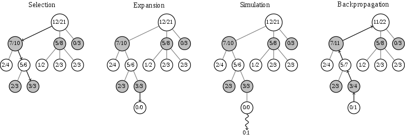

# Research Review: AlphaGo

## Goal

- Build an AI which master Go

## Problem

- The search space of Go is huge: b=250, d=150.  Exhaustive search is infeasible.

## Technique

- Monte Carlo tree search (MCTS):  Instead of min-max and alpha-beta search, most Go agents use MCTS as search algorithm.
  - Each round of Monte Carlo tree search consists of four steps.
  - Step 1, Selection: start from root R and select successive child nodes down to a leaf node L. The section below says more about a way of choosing child nodes that lets the game tree expand towards most promising moves, which is the essence of Monte Carlo tree search.
  - Step 2, Expansion: unless L ends the game with a win/loss for either player, either create one or more child nodes or choose from them node C.
  - Step 3, Simulation: play a random playout from node C. This step is sometimes also called playout or rollout.
  - Step 4, Backpropagation: use the result of the playout to update information in the nodes on the path from C to R.

  - Rounds of search are repeated as long as the time allotted to a move remains. Then the move with the most simulations made is selected rather than the move with the highest average win rate.
  - As the search store search history, it's memory consumption is high as breath first search.
- Deep convolutional neural networks:  Instead of handcrafted functions, deep convolutional neural networks is used as heuristic functions to reduce search breadth and depth.
  - Policy network:  To predict the probabilities of each moves.  Used in expansion part of MCTS.
  - Value network:  To evaluate a leaf node in MCTS.
  - Rollout network:  To evaluate a leaf node in MCTS.  Used in simulation part of MCTS.  It is 1500 times faster than policy network, but less performance.

## Result

- In 2015-10-09, AlphaGo defeat a human professional player Fan Hui in the full sized formal 5 games match of Go, 5-0.

## References

- AlphaGo: https://storage.googleapis.com/deepmind-media/alphago/AlphaGoNaturePaper.pdf
- Monte Carlo tree search: https://en.wikipedia.org/wiki/Monte_Carlo_tree_search
